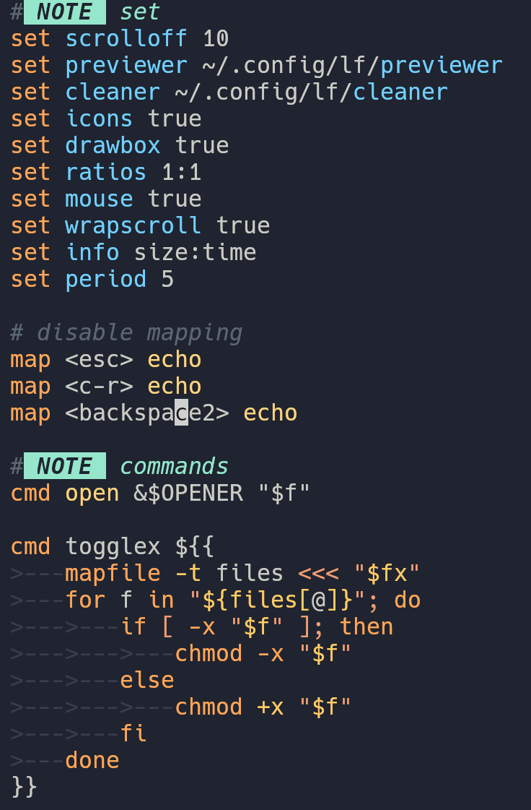

# vim-lfrc

- [lf, a great file manager](https://github.com/gokcehan/lf)

## Screenshot

Colorscheme is `ayu-mirage`.



## Why

- I like vim
- I like lf
- __Why not?__

## Current Stage

Work in progress.

Even though I have been using neovim for long time, I didn't try programming related to highlighting and syntax.

Though I tried this time, but I don't have plan to go deeper into writing vim syntax and highlight files.

__Feel free to copy this repo for your use__.

## Installation

- Manual Installation
    1. Prefer `:help vim.filetype.add` for nvim user.
    2. copy `./syntax/lfrc.vim` to `~/.config/nvim/syntax/` or equivalent.
    3. copy `./ftdetect/lfrc.vim` to `~/.config/nvim/ftdect` or equivalent.

- Use your favorite package manager

```lua
-- for lazy.nvim
{
    "Leenuus/vim-lfrc",
    ft = { "lfrc" },
}
```

## TODO

- [X] Link `lf` options to proper highlight group.
- [X] Match Builtin commands
- [ ] Match keybindings, and special key names
- [ ] Match one-liner shell command
- [ ] Match push command
- [ ] Match `:` command

## Learning Resources

I do read some stuff to understand how `syntax` works in vim basically.

- [learn vim the hard way](https://learnvimscriptthehardway.stevelosh.com/chapters/45.html)
- vim, `:help syn-region`
- [`renpy.vim` repo does inspire me to do this job](https://github.com/chaimleib/vim-renpy)
